# Supermarket revenue
## 1. Project description
Revenue analysis over the years

## 2. Purpose and Outcome
Purpose: Analyze sales by region and identify the supermarket's best-selling products.
Outcome: A set of actionable insights that show which regions generate the most revenue and which specific products contribute the most to overall sales.

Link: Public dataset from Kaggle (Superstore Sales: https://www.kaggle.com/datasets/bhanupratapbiswas/superstore-sales/data)

## 3. Dataset
Row_ID: A unique identifier for each row in the dataset, used to differentiate records.

Order_ID: The order ID, a unique identifier for each order.

Order_Date: The order date, indicating the date the customer placed the order.

Ship_Date: The ship date, the date the order was shipped.

Ship_Mode: The shipping method, indicating how the order was shipped.

Customer_ID: The customer ID, a unique identifier for each customer.

Customer_Name: The name of the customer who placed the order.

Segment: The customer segment, indicating the classification of the customer.

Country: The country, indicating the country where the customer or the order is processed.

City: The city, where the customer resides or where the order is shipped to.

State: The state or province, indicating the geographical region at the state level where the customer lives.

Postal_Code: The postal code, a code used to determine the exact shipping location.

Region: The region, indicating the geographical region to which the customer belongs.

Product_ID: The product ID, a unique identifier for each product in the database.

Category: The product category, indicating the type of product.

Sub_Category: The product sub-category, a more specific classification within each category.

Product_Name: The product name, the detailed name of the product sold.

Sales: The sales amount, the revenue generated from the product in this order.

## 4. Result
### 4.1. Data cleaning
- After adding the file to colab, check how the data looks like.

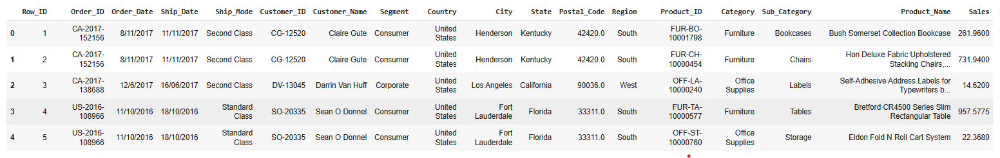

- Change the format of the date columns and add month, year and delivery time columns.
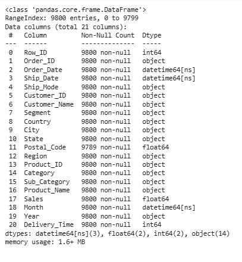

### 4.2. Revenue Analysis

**4.2.1. Monthly sales revenue**

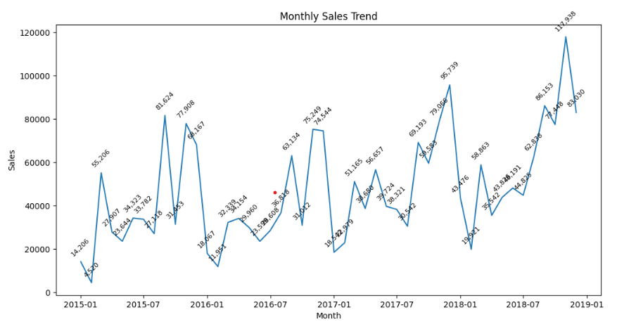

- Revenue comparison by month

1. Starting from August 2025, revenue is higher than in the first months of the year. Customers have a need to buy goods at the end of the year and that is also the peak season.

2. In 2016, revenue decreased significantly compared to the same period in 2015. By November, revenue began to increase again.

3. From 2017 onwards, the company has a fixed and loyal customer base. Therefore, revenue is also higher than in 2015.

**4.2.2. Compare sales and orders year by year**

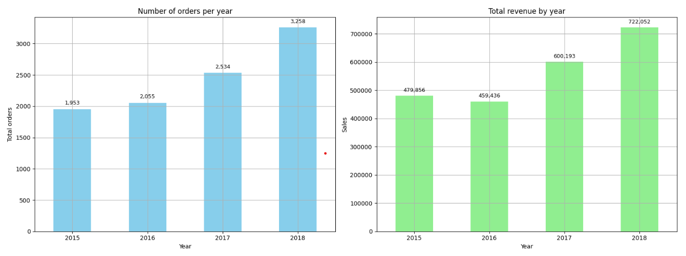

- Total orders vs revenue analysis

1. In 2015, with about 2,000 orders, the revenue was nearly 500 thousand USD. But in 2016, more than 2,000 orders but the revenue was lower. Showing that the order value in 2016 was not as high as in 2015.

2. However, since 2017, the number of orders has increased, and the revenue has also increased significantly. From there, it can be seen that the order value also increases with each order.

**4.2.3. Average per order**

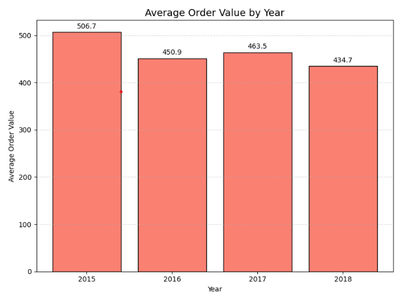

- Why is the order value getting lower every year?

1. In 2015, although the number of orders was low, the revenue was quite stable, the highest order value in 4 years.

2. In 2016, the number of orders increased, the revenue and value were lower than in 2015. This shows that customers spent less on each order.

3. In 2018, the number of orders and revenue were the highest, but the average order value was the lowest.

-> It may come from standard class customers, they dont spend much on each order or buy cheap products.

**4.2.4. Revenue during the week compared to the weekend**

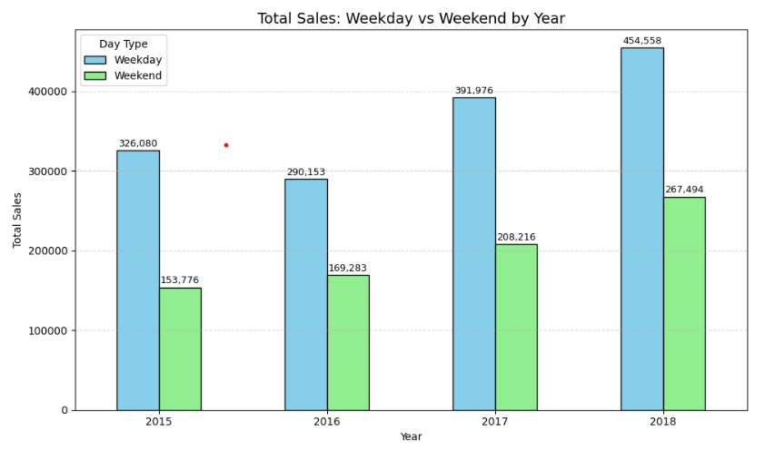

Why is weekday sales higher than weekend sales?

1. Weekday sales are always much higher than weekend sales. It seems that consumer behavior mainly occurs on working days.

2. Our main customers are mainly from businesses and can also buy in large quantities.

**4.2.4. Revenue by segment**

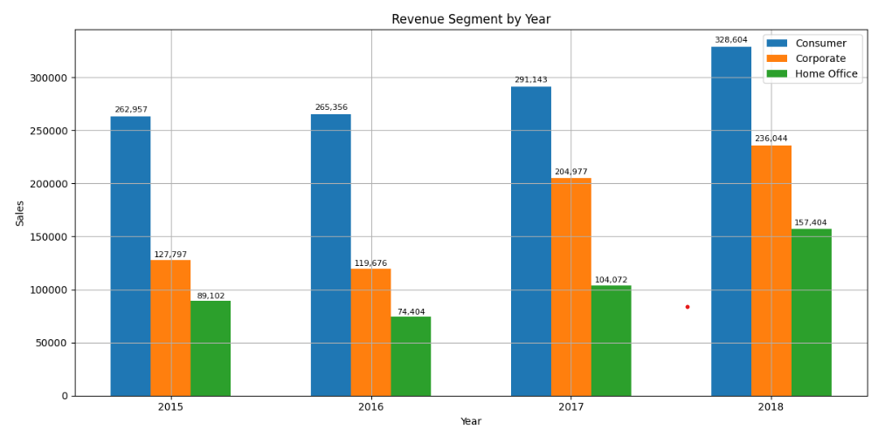

Customer segmentation analysis

1. In 4 years, revenue in 2016 decreased significantly compared to the remaining years. Especially the Home Office segment, the lowest in the years.

2. In 2018, the Corporate and Home Office segments doubled compared to the previous 3 years. It can be seen that revenue has improved significantly after 2016.

3. The main segment of supermarkets is still Consumer, leading over 4 years.

4. Home office and Coperate are in the development stage in the market, it is possible to consider to develop strategies and marketing to focus on these two segments.

**4.2.5. Revenue by Category**

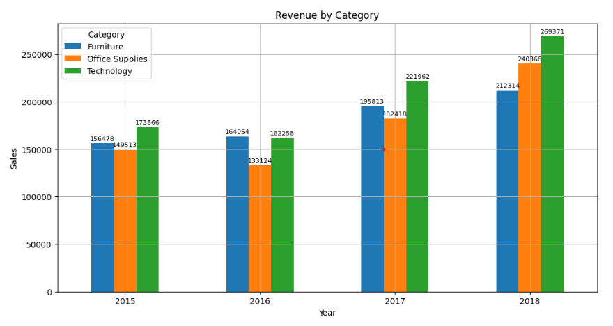

Why is the Technoly category growing the most?

1. The furniture category ranked second in revenue among the three categories, but grew the slowest. Perhaps customers are not too interested in Furniture.

2. Office Supplies in 2018 is doubling compared to 2015, perhaps because of a change in sales policy after a decline in revenue in 2016.

3. It can be seen that Technology is always at the top of the category, this is the year of the beginning of the 4.0 industrial revolution, so the market is showing a strong trend of developing the Technology industry, customers are willing to spend money to buy technology products to serve their work.

4. In addition, the development of the Technology market leads to businesses wanting to expand their company's scale, they are willing to open more offices. From there, customers will also be willing to spend on the Office Supplies category.

**4.2.6. Revenue by Customer Class**

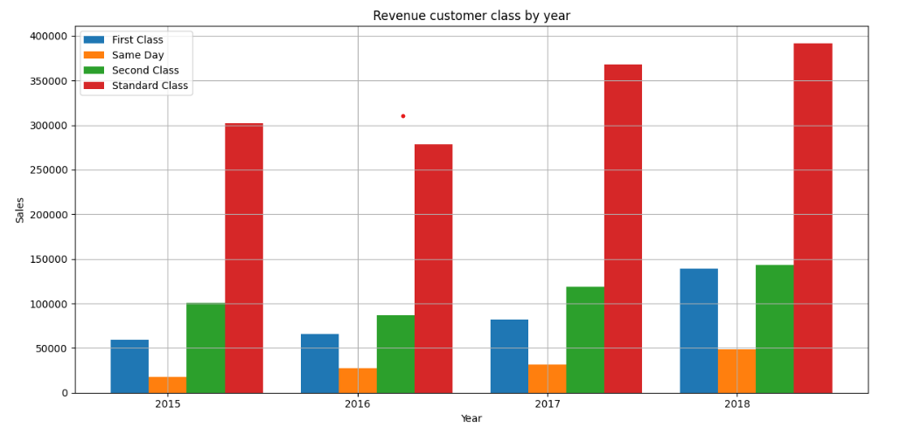

**Who is your customer class market?**

1. Standard class has the highest revenue and is superior to the remaining customer classes. This is our main customer, so we should maintain this loyal customer base and offer many incentive programs to thank them.

2. Second class has shown signs of increasing over the years and has the potential to become loyal customers. Create discount or combo programs to attract customers, but still ensure quality to turn them into loyal customers.

3. First class grew strongly in 2018 and their revenue is equal to second class. Maybe First class customers are starting to care about Technology or about price.

4. For Same day customers, this may not be our target customer group, so the revenue is the lowest compared to the remaining customer classes

**Revenue by Region**

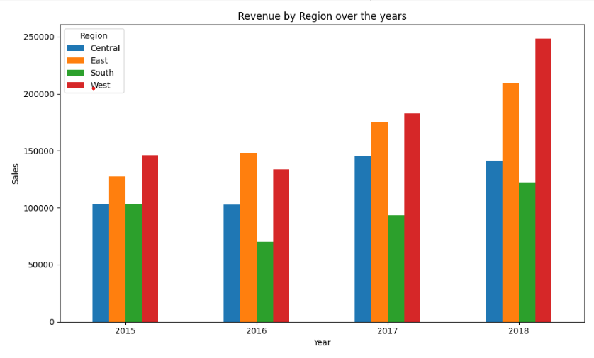

**Top 10 Product & City of the year**

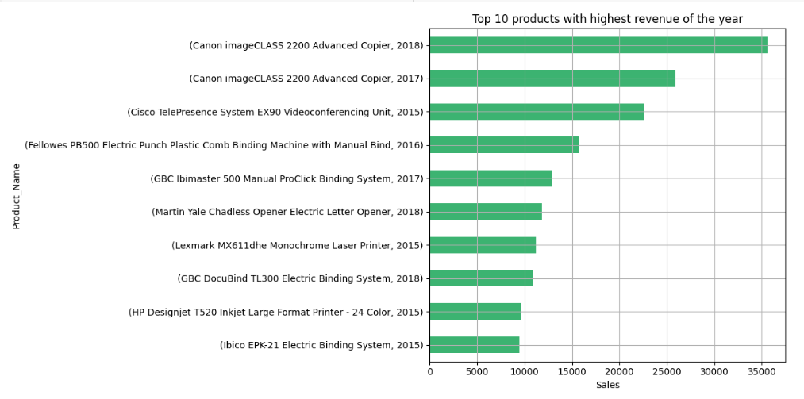

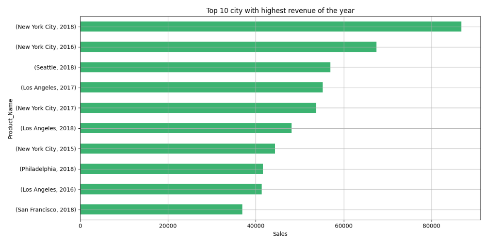

**Final Conclusion**

**Revenue Trend Analysis**
1. Economic trends are changing, leading to changes in customer purchasing needs.
2. Customers are willing to spend more on technology products than office products.
3. The decrease in revenue in 2016 is not due to delivery time.
4. New York has the highest revenue every year, showing that the trend of investing in technology in this state is increasing.
5. In particular, customers have the highest demand for printers in 4 years, maybe they start to expand their offices.

**What to do to increase revenue from the furniture category?**

1. Offer monthly promotions to customers who buy products from the furniture category.

2. Offer free shipping for customers with orders over $400.

3. Promote the product everywhere.

**How to increase revenue per order?**

1. Create combo programs by product.

2. Offer discount programs based on total order value. From there, customers tend to buy more to apply that program.

3. Discount products if customers buy together.

